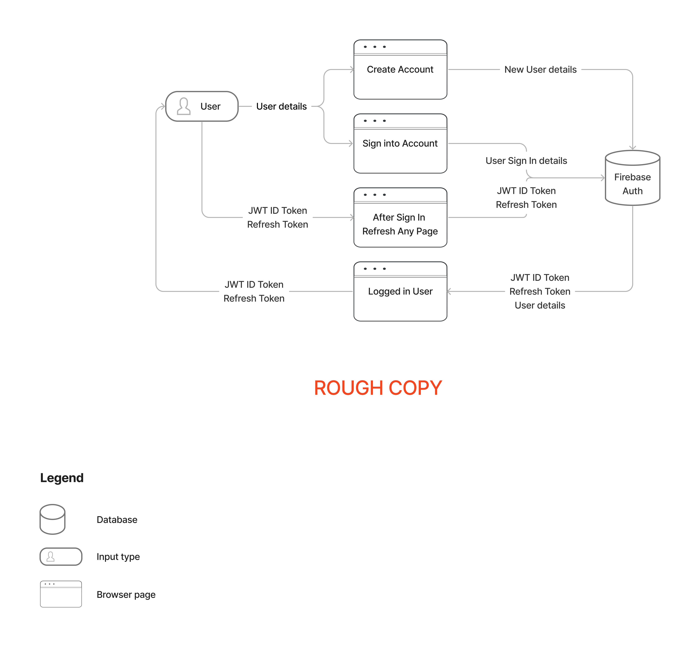
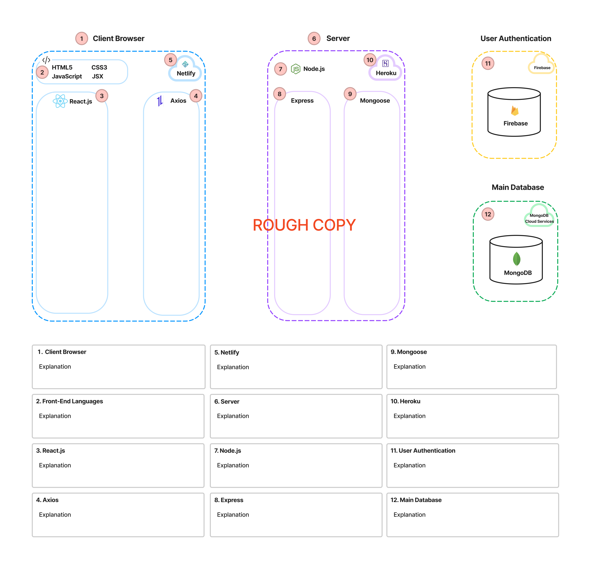
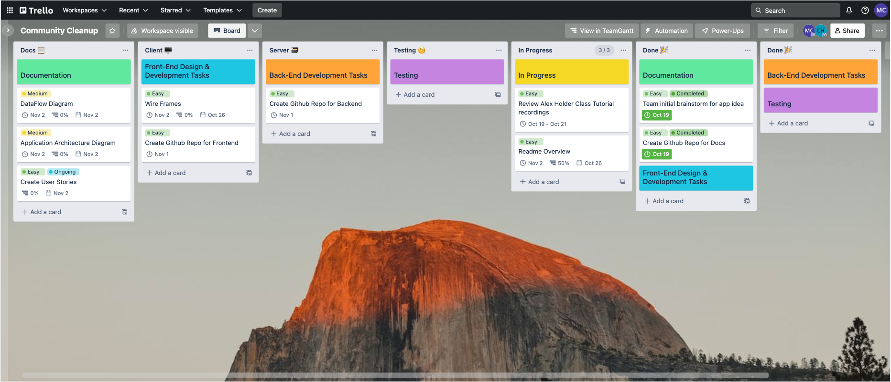

# Co Cleanup: MERN full-stack app <!-- omit in toc -->
### Chris Hullman & Mick Caffery <!-- omit in toc -->
### T3A2 (Part A) Assignment <!-- omit in toc -->

## Table of Contents <!-- omit in toc -->
- [Links](#links)
- [Overview](#overview)
  - [Purpose](#purpose)
  - [Functionality & Features](#functionality--features)
  - [Target Audience](#target-audience)
  - [Tech Stack](#tech-stack)
- [Dataflow Diagram](#dataflow-diagram)
- [Application Architecture Diagram](#application-architecture-diagram)
- [User Stories](#user-stories)
- [Wireframes](#wireframes)
- [Project Management](#project-management)
  - [Setup](#setup)
  - [Timeframe](#timeframe)
  - [Kanban Board](#kanban-board)
  - [Scrum Sprints & Ceremonies](#scrum-sprints--ceremonies)
    - [*Planning Meetings*](#planning-meetings)
    - [*Daily Standups*](#daily-standups)
    - [*Sprint Reviews*](#sprint-reviews)
  - [Pair Programming](#pair-programming)
- [Sprint 1](#sprint-1)
  - [Planning meeting 1](#planning-meeting-1)
  - [Planning meeting 2](#planning-meeting-2)
  - [Sprint Review](#sprint-review)
- [Sprint 2](#sprint-2)
  - [Planning meeting](#planning-meeting)
  - [Sprint Review](#sprint-review-1)
- [Sprint 3](#sprint-3)
  - [Planning meeting](#planning-meeting-1)
  - [Sprint Review](#sprint-review-2)
- [Sprint 4](#sprint-4)
  - [Planning meeting](#planning-meeting-2)
  - [Sprint Review](#sprint-review-3)
- [Sprint 5](#sprint-5)
  - [Planning meeting](#planning-meeting-3)
  - [Sprint Review](#sprint-review-4)

## Links

## Overview

### Purpose

After a natural disaster strikes, communities are often left with the enormous clean-up effort required to restore people's homes, businesses and community areas. During these times government, council and emergency services resources are often stretched thin. Co Cleanup, short for Community Cleanup, aims to help communities better coordinate the clean up process after a natural disaster, or any time that community members would like to coordinate group action for the betterment of their community. 

**Co Cleanup has been designed and built by Chris Hullman and Mick Caffery as their final cap-stone project for Coder Academy’s Full Stack Development Bootcamp, 2022.**

### Functionality & Features

- Post description, time, location of needing help with a cleanup

### Target Audience

Co Cleanup is aimed at community members, organisations, emergency services or councils to help inform and coordinate clean-up efforts post-natural disaster. Willing volunteers can use this app to know the time and locations of coordinated clean-ups and where help is most needed.

### Tech Stack

**Front-end:** HTML5, CSS3, JavaScript, React.js, Axios

**Back-end:** Node, ExpressJS, Mongoose, MongoDB

**Deployment (Server):** Heroku 

**Deployment (Database):** MongoDB Cloud Services

**Deployment (Front-End):** Netlify

**Testing:**  Jest

**Source Control:** Git & Github

**Project Management:** Trello

**UI Design:** Figma

## Dataflow Diagram

## Application Architecture Diagram

## User Stories

## Wireframes

## Project Management

### Setup

In the beginning, we discussed how we should effectively manage the project and the tools we should use. We aimed to incorporate different tools and methods from Agile Project Management frameworks like Scrum and Kanban that would suit our team size, project scope and timeframe. 

### Timeframe

We were given a timeframe of five weeks to complete both Part A and Part B of the assignment, starting on Wednesday 19th of October 2022 until the final due date of Wednesday 23rd of November 2022. The contact hours throughout the Bootcamp were Monday to Wednesday, 9 am to 5 pm. We chose to keep this as the core contact hours for the project. Due to team members' work commitments and job search efforts, we decided that any additional hours from Thursday to Sunday would be planned ahead.

### Kanban Board

We decided to use Trello to manage our Kanban board as we both had experience with this product. We used the Kanban board to create a backlog of tasks or user stories that would be required to move the project forward. Then move each item into an “in progress” section while being worked on, then finally move the item to the “done” section once complete. As a team, we both took responsibility for organising the backlog and communicating to each which items were being updated. 

### Scrum Sprints & Ceremonies

We decided to break the 5-week period into five sprints based on the Scrum framework. We would use these sprints to plan and build our product in a series of five iterations, which would help break down the final product into manageable pieces of work. We predict that this approach will help us ship our work sooner and more frequently, whilst giving us the opportunity to adapt and change as we receive feedback from user testing. 

#### *Planning Meetings*

We decided that each sprint would start each Wednesday and begin with the planning ceremony (meeting). During each planning meeting we discussed what we would like to achieve during the sprint and the value that goal would bring to the project. We then moved items from the product backlog that were necessary to complete the sprint, and delegated how we would complete these items. Finally each of the items moved from the backlog was broken down into an increment that would be achievable to be completed in one day.

Based on this approach, each planning meeting addressed the following three questions:

**What is the main sprint goal and the value that would bring to the project?**

**Which items can be moved from the backlog to achieve this goal?**

**How should we break down the chosen items into daily increments?**

To help with tracking the tasks in each week's sprint we used a Gantt chart. The Gantt chart we used was a Trello power-up created by TeamGantt, making it easy to move tasks in the backlog into each sprint. 

#### *Daily Standups*

The purpose of our team's morning standup (during core days) was to discuss the progress towards the sprint goal and adapt the backlog as necessary. As we were a small team of just two, on top of our morning stand-up we were in frequent communication throughout the day discussing any challenges or re-evaluating the daily plan. 

#### *Sprint Reviews*

The purpose of our sprint reviews is to review what was accomplished during the Sprint, adjust the product backlog, and determine future adaptations to the project. 

### Pair Programming

We wanted to incorporate pair programming into our workflow as a way to share knowledge, write better code and problem solve together. We chose to use pair programming as a way get started on our server and client code bases, and when each of us encountered any difficult work items. The main tool we used to pair program was VS Code Live Share. We discovered this was a great tool where we could collaborate and write code in unison live on the one project. While pair programming in VS Code Live Share we used Discord to provide video, voice and chat. 

## Sprint 1

### Planning meeting 1

We kicked off the project with an initial planning meeting. This is where we discussed potential ideas and submitted our chosen idea for approval. We then discussed how we would like to manage the project and which tools and methods would suit. We then talked about the initial tasks that we both would work on. 

The Kanban board below was created after this initial planning meeting and reflects these initial tasks and backlog. We decided that we should place an emphasis on revising the MERN masterclass presented by our class instructors on the previous two days, as the concepts covered were crucial to our team performing well on this assignment.

Due to the first day of the project starting on Wednesday, and the core contact hours for the project being Monday to Wednesday we decided that we would hold another planning meeting on the following Monday. 

### Planning meeting 2

**The topics discussed were:**

**What is the main sprint goal and the value it would bring to the project?**

- The main sprint goal this week was to have a basic Express server deployed to Heroku with CRUD functionality for ‘users’ and ‘events’, with data being stored on MongoDB cloud. On top of this we would create a React Front end deployed to Netlify with a simple form to create an event. 
- A secondary goal was to have all of our initial users stories documented
- These goals would bring value to our project by following the principles of CI/CD and the mantra “deploy often and deploy early”. Due to the flexibility of Express and the MongoDB data structure we aimed to build a working “core server” that was deployed that we could build upon as we worked through each user story.

**Which items can be moved from the backlog to achieve this goal?**

- Items moved from the backlog included:
  - Setting up Express Back-end and deploy
  - Document user stories
  - Scaffold React front-end and deploy
  - Build basic forms for Register & Sign In
  - Build basic form for Registering an Event

**How should we break down the chosen items into daily increments?**

- Each of the items in Sprint 1 were less than one days work
  - Monday would be spent developing User stories and documentation
  - Tuesday would be spent Setting up Express Back-end and deploy
  - Wednesday would be spent setting up React front-end, deployment and basic forms

### Sprint Review

Insert Trello Screenshot

Insert Gantt Chart Screenshot

## Sprint 2

### Planning meeting

**The topics discussed were:**

**What is the main sprint goal and the value that would bring to the project?**

**Which items can be moved from the backlog to achieve this goal?**

**How should we break down the chosen items into daily increments?**

### Sprint Review

Short overview of what was achieved

Insert Trello Screenshot

Insert Gantt Chart Screenshot

## Sprint 3

### Planning meeting

**The topics discussed were:**

**What is the main sprint goal and the value that would bring to the project?**

**Which items can be moved from the backlog to achieve this goal?**

**How should we break down the chosen items into daily increments?**

### Sprint Review

Short overview of what was achieved

Insert Trello Screenshot

Insert Gantt Chart Screenshot

## Sprint 4

### Planning meeting

**The topics discussed were:**

**What is the main sprint goal and the value that would bring to the project?**

**Which items can be moved from the backlog to achieve this goal?**

**How should we break down the chosen items into daily increments?**

### Sprint Review

Short overview of what was achieved

Insert Trello Screenshot

Insert Gantt Chart Screenshot

## Sprint 5

### Planning meeting

**The topics discussed were:**

**What is the main sprint goal and the value that would bring to the project?**

**Which items can be moved from the backlog to achieve this goal?**

**How should we break down the chosen items into daily increments?**

### Sprint Review

Short overview of what was achieved

Insert Trello Screenshot

Insert Gantt Chart Screenshot
