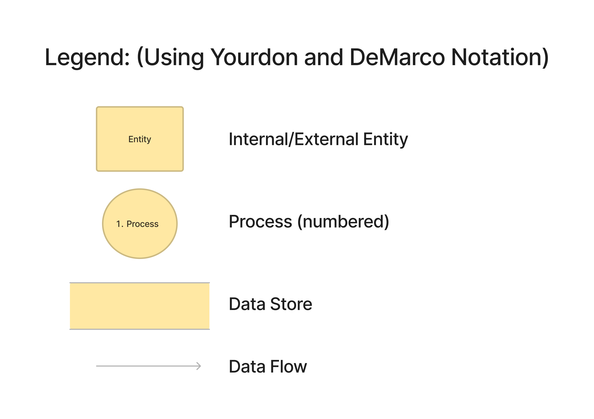
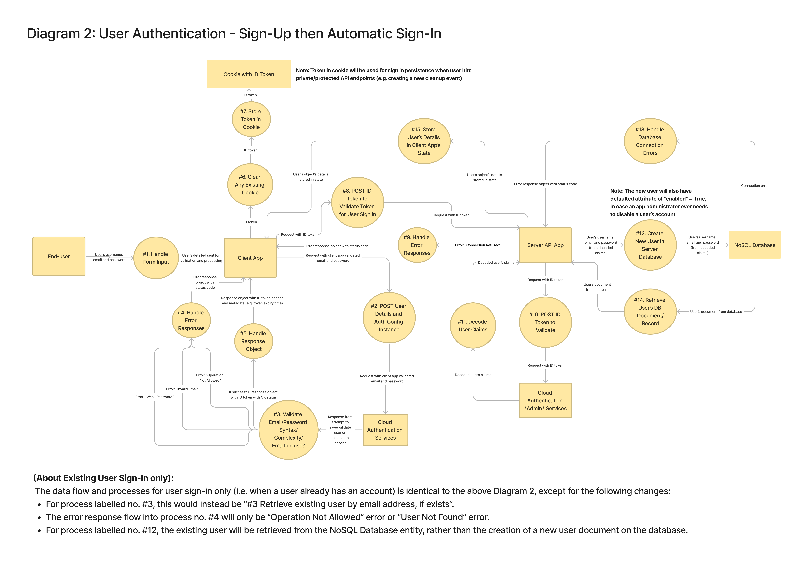
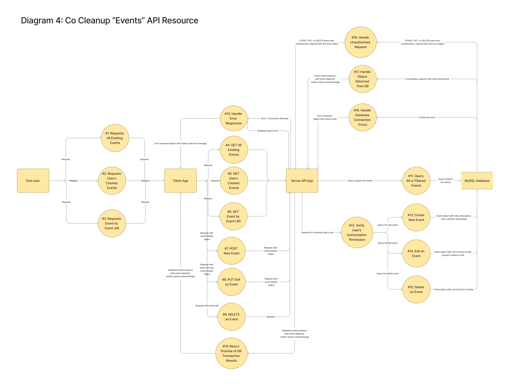
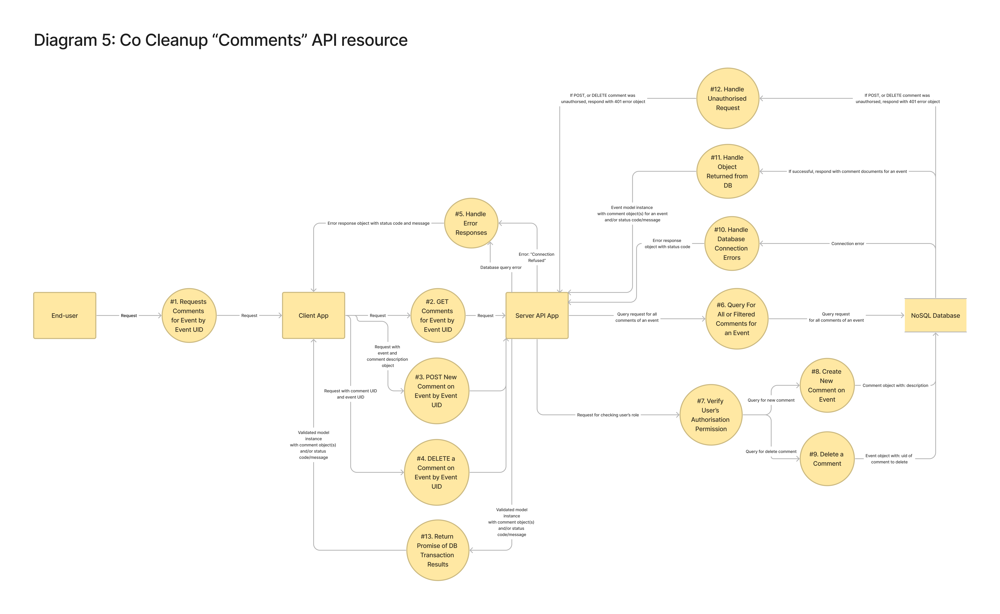

# Co Cleanup: MERN full-stack app <!-- omit in toc -->
### Chris Hullman & Mick Caffery <!-- omit in toc -->
### T3A2 (Part A) Assignment <!-- omit in toc -->

## Table of Contents <!-- omit in toc -->
- [Links](#links)
- [Overview](#overview)
  - [Purpose](#purpose)
  - [Functionality & Features](#functionality--features)
  - [Target Audience](#target-audience)
  - [Tech Stack](#tech-stack)
- [Dataflow Diagram](#dataflow-diagram)
- [Application Architecture Diagram](#application-architecture-diagram)
- [User Stories](#user-stories)
- [Wireframes](#wireframes)
- [Project Management](#project-management)
  - [Setup](#setup)
  - [Timeframe](#timeframe)
  - [Kanban Board](#kanban-board)
  - [Scrum Sprints & Ceremonies](#scrum-sprints--ceremonies)
    - [*Planning Meetings*](#planning-meetings)
    - [*Daily Standups*](#daily-standups)
    - [*Sprint Reviews*](#sprint-reviews)
  - [Pair Programming](#pair-programming)
- [Sprint 1](#sprint-1)
  - [Planning meeting 1](#planning-meeting-1)
  - [Planning meeting 2](#planning-meeting-2)
  - [Sprint Review](#sprint-review)
- [Sprint 2](#sprint-2)
  - [Planning meeting](#planning-meeting)
  - [Sprint Review](#sprint-review-1)
- [Sprint 3](#sprint-3)
  - [Planning meeting](#planning-meeting-1)
  - [Sprint Review](#sprint-review-2)
- [Sprint 4](#sprint-4)
  - [Planning meeting](#planning-meeting-2)
  - [Sprint Review](#sprint-review-3)
- [Sprint 5](#sprint-5)
  - [Planning meeting](#planning-meeting-3)
  - [Sprint Review](#sprint-review-4)

## Links

## Overview

### Purpose

After a natural disaster strikes, communities are often left with the enormous clean-up effort required to restore people's homes, businesses and community areas. During these times government, council and emergency services resources are often stretched thin. Co Cleanup, short for Community Cleanup, aims to help communities better coordinate the clean up process after a natural disaster, or any time that community members would like to coordinate group action for the betterment of their community. 

**Co Cleanup has been designed and built by Chris Hullman and Mick Caffery as their final cap-stone project for Coder Academy’s Full Stack Development Bootcamp, 2022.**

### Functionality & Features

- Post description, time, location of needing help with a cleanup

### Target Audience

Co Cleanup is aimed at community members, organisations, emergency services or councils to help inform and coordinate clean-up efforts post-natural disaster. Willing volunteers can use this app to know the time and locations of coordinated clean-ups and where help is most needed.

### Tech Stack

**Front-end:** HTML5, CSS3, JavaScript, React.js, Axios

**Back-end:** Node, ExpressJS, Mongoose, MongoDB

**Deployment (Server):** Heroku 

**Deployment (Database):** MongoDB Cloud Services

**Deployment (Front-End):** Netlify

**Testing:**  Jest

**Source Control:** Git & Github

**Project Management:** Trello

**UI Design:** Figma

## Dataflow Diagram

### Note about the below diagrams

**Besides the 'Legend' diagram below, all subsequent Dataflow Diagrams have their processes (circle shapes) numbered.**

**The numbered lists below each Dataflow Diagram indicate the sequence, in ascending order, of data flow for each process. Note however that many processes are performed asynchronously, or sometimes not at all for any given live process transaction - e.g. in the case of error responses.**

1. One or more developers on a local development machine will push (or pull request) the latest code base to the central main/master branch of a version control/source code repository.
2. With repository and client or server app cloud 'Platform as a Service' (PaaS) authorised to link together, the intial version of the code base will automatically sent to the PaaS system.
3. Polls will be sent to and/or from the repository and the PaaS system to monitor for codebase changes, and if a new change is detected, automically re-push the new code onto the PaaS system (i.e. Continuous Deployment).
4. The client or server app PaaS system will request from a Certificate Authority (CA) for a new or renewed TSL/SSL certificate.
5. The signed certificate will be sent back to the client or server app PaaS system to enable HTTPS on the deployed client or server app.
6. For the client app, the public access keys to the cloud authentication services systems will be sent.
7. The cloud authentication services systems will return an authentication ID token to store in a cookie on the client app PaaS system.

## Application Architecture Diagram

## User Stories

The Co Cleanup app [Trello User Stories board here](https://trello.com/b/kBMQdaEN/user-stories-co-cleanup) has an **INFORMATION** list (first board column) with cards that explain the approach, formatting and syntax to reading and editing the board and its User Stories. Below are direct links to the information cards (for each card, please read the card title, and the card description, if there is one):

- Structure of a User Story text - [https://trello.com/c/ikJvrfnR](https://trello.com/c/ikJvrfnR)
- Who are the personas? - [https://trello.com/c/uO42CR5e](https://trello.com/c/uO42CR5e)
- About RED labelled cards - [https://trello.com/c/FrhWO1ks](https://trello.com/c/FrhWO1ks)
- About ORANGE labelled cards - [https://trello.com/c/DpYXKgNt](https://trello.com/c/DpYXKgNt)
- How to delete/discard cards - [https://trello.com/c/3QqTMrCv](https://trello.com/c/3QqTMrCv)
- How to edit cards - [https://trello.com/c/zDDxwutQ](https://trello.com/c/zDDxwutQ)

### Revision 1:

This is the original draft User Stories version from Week 1 of the sprint, with the planned articulated User Stories categorised into persona needs and "must haves" vs "would like to have" features of the app.

### Revision 2:

In this revision from Week 2 of the sprint, the following changes were made:
- It was discussed and clarified that our target audience would like to see, as view only, all existing cleaning events that are scheduled without needing to be signed in to the app.
- For clarity, when the user first signs up into the app, they can specify a nickname as their username, hence we discarded the user story card relating to concerns of privacy of the user's full, real name.

### Revision 3:

In this revision from Week 2 of the sprint, the following changes were made:
- The functionality for a user to upload and attach one or more photos to an event when creating their own event will be an optional (i.e. "would like to") requirement outside of scope of MVP as per discussed project timeframe concerns.

## Wireframes

## Project Management

### Setup

In the beginning, we discussed how we should effectively manage the project and the tools we should use. We aimed to incorporate different tools and methods from Agile Project Management frameworks like Scrum and Kanban that would suit our team size, project scope and timeframe. 

### Timeframe

We were given a timeframe of five weeks to complete both Part A and Part B of the assignment, starting on Wednesday 19th of October 2022 until the final due date of Wednesday 23rd of November 2022. The contact hours throughout the Bootcamp were Monday to Wednesday, 9 am to 5 pm. We chose to keep this as the core contact hours for the project. Due to team members' work commitments and job search efforts, we decided that any additional hours from Thursday to Sunday would be planned ahead.

### Kanban Board

We decided to use Trello to manage our Kanban board as we both had experience with this product. We used the Kanban board to create a backlog of tasks or user stories that would be required to move the project forward. Then move each item into an “in progress” section while being worked on, then finally move the item to the “done” section once complete. As a team, we both took responsibility for organising the backlog and communicating to each which items were being updated. 

### Scrum Sprints & Ceremonies

We decided to break the 5-week period into five sprints based on the Scrum framework. We would use these sprints to plan and build our product in a series of five iterations, which would help break down the final product into manageable pieces of work. We predict that this approach will help us ship our work sooner and more frequently, whilst giving us the opportunity to adapt and change as we receive feedback from user testing. 

#### *Planning Meetings*

We decided that each sprint would start each Wednesday and begin with the planning ceremony (meeting). During each planning meeting we discussed what we would like to achieve during the sprint and the value that goal would bring to the project. We then moved items from the product backlog that were necessary to complete the sprint, and delegated how we would complete these items. Finally each of the items moved from the backlog was broken down into an increment that would be achievable to be completed in one day.

Based on this approach, each planning meeting addressed the following three questions:

**What is the main sprint goal and the value that would bring to the project?**

**Which items can be moved from the backlog to achieve this goal?**

**How should we break down the chosen items into daily increments?**

To help with tracking the tasks in each week's sprint we used a Gantt chart. The Gantt chart we used was a Trello power-up created by TeamGantt, making it easy to move tasks in the backlog into each sprint. 

#### *Daily Standups*

The purpose of our team's morning standup (during core days) was to discuss the progress towards the sprint goal and adapt the backlog as necessary. As we were a small team of just two, on top of our morning stand-up we were in frequent communication throughout the day discussing any challenges or re-evaluating the daily plan. 

#### *Sprint Reviews*

The purpose of our sprint reviews is to review what was accomplished during the Sprint, adjust the product backlog, and determine future adaptations to the project. 

### Pair Programming

We wanted to incorporate pair programming into our workflow as a way to share knowledge, write better code and problem solve together. We chose to use pair programming as a way get started on our server and client code bases, and when each of us encountered any difficult work items. The main tool we used to pair program was VS Code Live Share. We discovered this was a great tool where we could collaborate and write code in unison live on the one project. While pair programming in VS Code Live Share we used Discord to provide video, voice and chat. 

## Sprint 1

### Planning meeting 1

We kicked off the project with an initial planning meeting. This is where we discussed potential ideas and submitted our chosen idea for approval. We then discussed how we would like to manage the project and which tools and methods would suit. We then talked about the initial tasks that we both would work on. 

The Kanban board below was created after this initial planning meeting and reflects these initial tasks and backlog. We decided that we should place an emphasis on revising the MERN masterclass presented by our class instructors on the previous two days, as the concepts covered were crucial to our team performing well on this assignment.

Due to the first day of the project starting on Wednesday, and the core contact hours for the project being Monday to Wednesday we decided that we would hold another planning meeting on the following Monday. 

### Planning meeting 2

**The topics discussed were:**

**What is the main sprint goal and the value it would bring to the project?**

- The main sprint goal this week was to have a basic Express server deployed to Heroku with CRUD functionality for ‘users’ and ‘events’, with data being stored on MongoDB cloud. On top of this we would create a React Front end deployed to Netlify with a simple form to create an event. 
- A secondary goal was to have all of our initial users stories documented
- These goals would bring value to our project by following the principles of CI/CD and the mantra “deploy often and deploy early”. Due to the flexibility of Express and the MongoDB data structure we aimed to build a working “core server” that was deployed that we could build upon as we worked through each user story.

**Which items can be moved from the backlog to achieve this goal?**

- Items moved from the backlog included:
  - Setting up Express Back-end and deploy
  - Document user stories
  - Scaffold React front-end and deploy
  - Build basic forms for Register & Sign In
  - Build basic form for Registering an Event

**How should we break down the chosen items into daily increments?**

  - Monday would be spent developing User stories and documentation
  - Tuesday would be spent Setting up Express Back-end and deploy
  - Wednesday would be spent setting up React front-end, deployment and basic forms

### Sprint Review

The screenshots below show the implementation board at the end of week 1, which marks the end of our first sprint. We achieved the majority of what we planned for the sprint, however, did not start any development of the front end. The Gantt chart shows which items we worked on each day of the sprint. 

As this was the first sprint for the assignment we learnt a lot about time management and what is achievable in a single sprint. We also came up against parts of the development process that were more difficult than expected. 

During this sprint, a difficult task was understanding how to set up Firebase Authentication on the frontend. We decided that we should adjust our backlog and devote time to researching and understanding how best to implement Firebase authentication into our project. 

There were no major adaptations to the project. However, in review, we were able to adjust which tasks should be given priority in order to meet the assignment requirement of submitting the Part A documentation by the end of sprint two. 

## Sprint 2

### Planning meeting

**The topics discussed were:**

**What is the main sprint goal and the value that would bring to the project?**

- The main sprint goal this week was to research and understand Firebase Authentication. Our next main goal was to finish all the required wireframes, diagrams, and Readme documentation required for the Part A submission. 
- The value these goals would bring to the project would be that through a better understanding of authentication, we would be able to design and draw more accurate data flow diagrams, which is a requirement for Part A. The goal of finalising the Readme documentation ahead of time, will also allow us to review and make any changes before the Part A due date, and also enable us to continue working on Part B of the assignment. 

**Which items can be moved from the backlog to achieve this goal?**

- Items moved from the backlog included:
  - Research Firebase Authentication
  - DataFlow Diagram Increment 2
  - Architecture Diagram Increment 2
  - Finalise Wireframes
  - Finalise Part A Readme

**How should we break down the chosen items into daily increments?**

- Following on from our previous sprint, the dataflow diagram and architecture diagram have already been broken down into a daily increments, with the first increments being completed in sprint 1. The remainder of the tasks have been planned to take less than one day.

### Sprint Review

Short overview of what was achieved

Insert Trello Screenshot

Insert Gantt Chart Screenshot

## Sprint 3

### Planning meeting

**The topics discussed were:**

**What is the main sprint goal and the value that would bring to the project?**

**Which items can be moved from the backlog to achieve this goal?**

**How should we break down the chosen items into daily increments?**

### Sprint Review

Short overview of what was achieved

Insert Trello Screenshot

Insert Gantt Chart Screenshot

## Sprint 4

### Planning meeting

**The topics discussed were:**

**What is the main sprint goal and the value that would bring to the project?**

**Which items can be moved from the backlog to achieve this goal?**

**How should we break down the chosen items into daily increments?**

### Sprint Review

Short overview of what was achieved

Insert Trello Screenshot

Insert Gantt Chart Screenshot

## Sprint 5

### Planning meeting

**The topics discussed were:**

**What is the main sprint goal and the value that would bring to the project?**

**Which items can be moved from the backlog to achieve this goal?**

**How should we break down the chosen items into daily increments?**

### Sprint Review

Short overview of what was achieved

Insert Trello Screenshot

Insert Gantt Chart Screenshot
