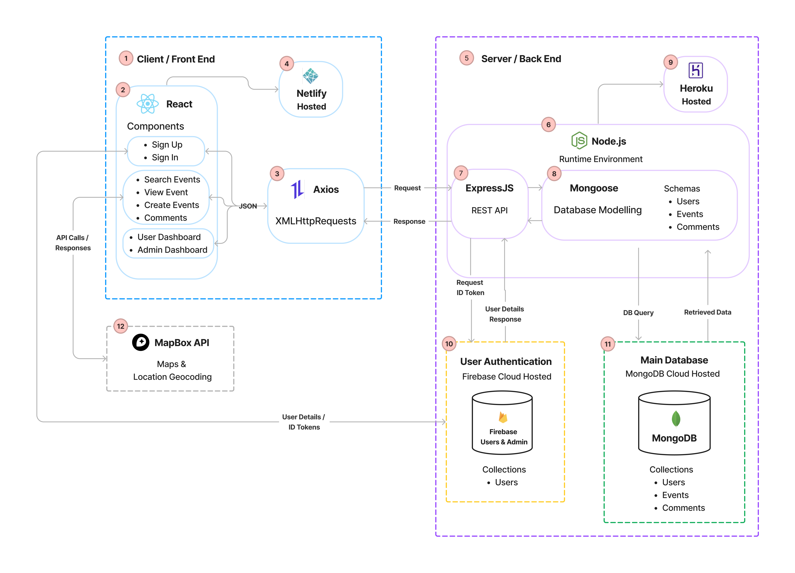
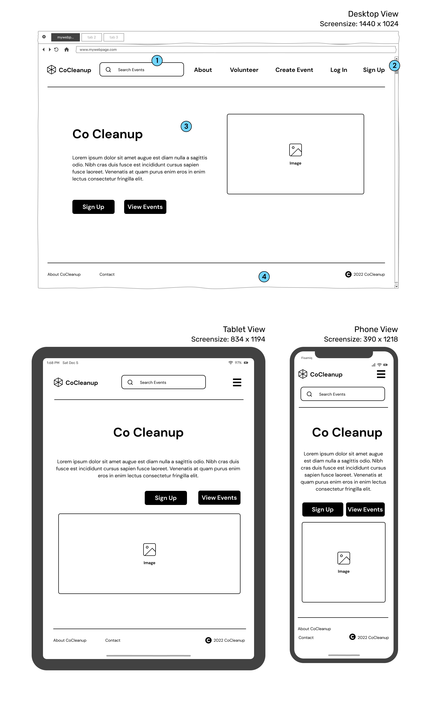
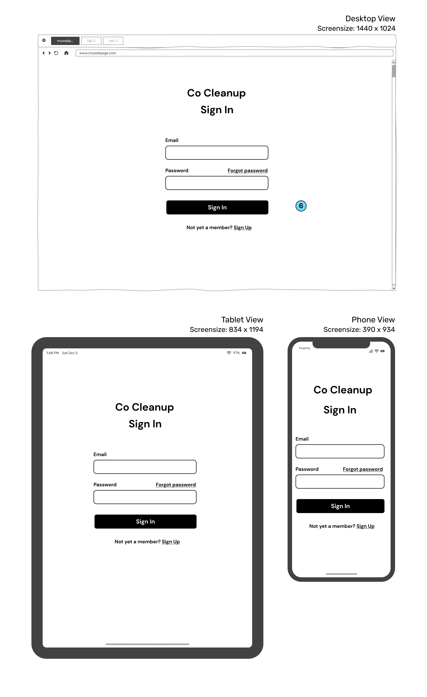
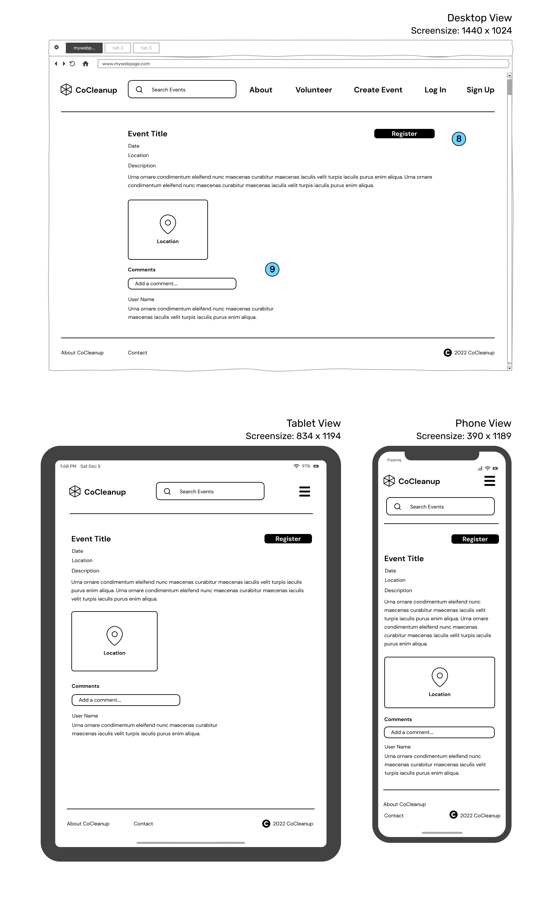

# Co Cleanup: MERN full-stack app <!-- omit in toc -->
### Chris Hullman & Mick Caffery <!-- omit in toc -->
### T3A2 (Part A) Assignment <!-- omit in toc -->

## Table of Contents <!-- omit in toc -->
- [Links](#links)
- [Overview](#overview)
  - [Purpose](#purpose)
  - [Functionality & Features](#functionality--features)
  - [Target Audience](#target-audience)
  - [Tech Stack](#tech-stack)
- [Dataflow Diagram](#dataflow-diagram)
- [Application Architecture Diagram](#application-architecture-diagram)
- [User Stories](#user-stories)
- [Wireframes](#wireframes)
  - [Landing Page](#landing-page)
  - [Sign Up Page](#sign-up-page)
  - [Sign In Page](#sign-in-page)
  - [Events Search Page](#events-search-page)
  - [Event Page](#event-page)
  - [Create & Update Event Page](#create--update-event-page)
  - [User Dashboard](#user-dashboard)
  - [Admin Dashboard](#admin-dashboard)
- [Project Management](#project-management)
  - [Overview](#overview-1)
  - [Timeframe](#timeframe)
  - [Kanban Board](#kanban-board)
  - [Scrum Sprints & Ceremonies](#scrum-sprints--ceremonies)
    - [*Planning Meetings*](#planning-meetings)
    - [*Daily Standups*](#daily-standups)
    - [*Sprint Reviews*](#sprint-reviews)
  - [Pair Programming](#pair-programming)
  - [Source Control](#source-control)
- [Sprint 1](#sprint-1)
  - [Planning meeting 1](#planning-meeting-1)
  - [Planning meeting 2](#planning-meeting-2)
  - [Sprint Review](#sprint-review)
- [Sprint 2](#sprint-2)
  - [Planning meeting](#planning-meeting)
  - [Sprint Review](#sprint-review-1)

## Links

## Overview

### Purpose

After a natural disaster strikes, communities are often left with the enormous clean-up effort required to restore people's homes, businesses and community areas. During these times government, council and emergency services resources are often stretched thin. Co Cleanup, short for Community Cleanup, aims to help communities better coordinate the clean up process after a natural disaster, or any time that community members would like to coordinate group action for the betterment of their community. 

**Co Cleanup has been designed and built by Chris Hullman and Mick Caffery as their final cap-stone project for Coder Academy’s Full Stack Development Bootcamp, 2022.**

### Functionality & Features

The functionality & features are described below for unregistered visitors, registered users and administrators. 

**Visitors**

- Can view the landing page to understand Co Cleanups' purpose and why it might be useful
- Can search and view all planned clean up events (locations displayed on a map)
- Are able to sign up to become a registered user

**Registered Users**

- Can create clean up events
- Can register to participate in a clean up event
- Can add comments to a clean up event

**Administrators**

- Can search for and view all users
- Can deactivate users or events

### Target Audience

Co Cleanup is aimed at community members, organisations, emergency services or councils to help inform and coordinate clean-up efforts post-natural disaster. Willing volunteers can use this app to know the time and locations of coordinated clean-ups and where help is most needed.

### Tech Stack

**Front-end:** HTML5, CSS3, JavaScript, React.js, Axios

**Back-end:** Node, ExpressJS, Mongoose, MongoDB

**Authentication:** Firebase Authentication

**Deployment (Server):** Heroku 

**Deployment (Database):** MongoDB Cloud Services

**Deployment (Front-End):** Netlify

**APIs** Mapbox maps & geocoding

**Testing:**  Jest

**Source Control:** Git & Github

**Project Management:** Trello & TeamGantt

**UI Design:** Figma

## Dataflow Diagram

## Application Architecture Diagram

**Legend**

1. The client (front end) represents the technologies that users interact with directly. The main components are React (components), Axios (XHR), and deployed on Netlify
2. React is an open-source front-end JavaScript library for building user interfaces with UI components. The diagram shows the main front-end React components that make up the application. Each of these components uses Axios to make XHR requests and the event pages use the Mapbox API for geocoding.  
3. Axios is a promise-based XMLHttpRequests (XHR) client that is used to make requests to the backend. These requests send and receive JSON data. An example is sending data from the “Create Event” form to a backend REST API endpoint. The React front-end components also receive JSON data via Axios to update state and access the data. 
4. The front end is built, deployed and hosted by Netlify, which also allows for automated deployments direct from Github. 
5. The server (back end) represents all of the technologies that process incoming requests from the client and generate the response. The server uses Node.js as an environment runtime, ExpressJS to create the REST API, Mongoose for database modelling, Firebase for user authentication and MongoDB as a cloud-hosted NoSQL database. 
6. Node.js is the environment runtime that executes JavaScript code outside of a web browser. 
7. ExpressJS is a backend framework that is used to build RESTful APIs. ExpressJS has been used to create all the backend API endpoints for CRUD operations for different database collections. 
8. Mongoose is used to create database models using schemas. These schemas represent how data will be stored in each database collection. Mongoose is responsible for creating and reading documents from the MongoDB database. 
9. The Node.js backend is built, deployed and hosted by Heroku. Heroku also allows for automated deployments direct from Github. 
10. Firebase Authentication provides a front and back-end authentication service, via node.js software development kits (SDK). These kits handle the authentication for the application. Firebase stores user details on a Firebase database. 
11. MongoDB is a NoSQL cloud-hosted database. With the use of Mongoose, data is modelled and stored within collections. 
12. The Mapbox Maps API is used to display Mapbox-created maps that can be used as a base layer for location data to be overlaid. The Mapbox Geocoding API converts location text into geographic coordinates. Geocoding is used when a user creates an event, then the location can be plotted on the base layer map. 

## User Stories

## Wireframes

### Landing Page

The landing page will be the page that visitors see when they navigate to the root URL. It is designed so that users can quickly learn what the app is for and why it might be useful for them. Details about this page include:

1. The search bar can be used by visitors who are not logged in to view events. When the search bar is focused, the landing page will navigate to the events search page. The about and volunteer links will navigate to information about how the site work and how users can volunteer at events. The create event link will navigate to the create event form, but only if the user is signed in. If the user is not signed in, then this form will navigate to the sign up page.
2. The log in and sign up links will not be displayed if a user is signed in, instead a user account icon link will be displayed.
3. The landing page component will consist of a Co Cleanup title, blurb about Co Cleanup, hero image and links to sign up and view events. 
4. The footer will have links to the about and contact pages, along with copyright text. 

### Sign Up Page

The sign up page is a minimal design that makes it clear to the user what is needed to sign up.

5. By signing up the users agree to the Terms of Service, Privacy Policy, and Cookie Policy. Coloring and underlining will show the user that these headings are also clickable links so that they can read the associated terms and policies.

### Sign In Page

The sign in page is another minimal design and will use similar components for the sign up page.

6. There will be a link to the sign up page, in case the user has not created an account previously. 

### Events Search Page

7. The events search page is designed so that users can easily see which clean up events have been organised and where they are located. As users search for either event names or locations, the list of events will be filtered, and associated markers displayed on the map.

### Event Page

The event page is designed to clearly show all details about the upcoming event.

8. A register button so that signed in users can register for an event. If the users are not registered, then this button will navigate them to the sign in page. 
9. Is a feature for users to be able to leave comments about the event, so that event organisers can reply with further information. 

### Create & Update Event Page

The create event page is designed so that users can easily create and update events. 

10. Signed in users can navigate to this page from the create event button in the navbar. If they would like to update an event they can navigate to update event page by a link in their user dashboard under the heading “My Events”, which lists the events they have organised. 

### User Dashboard

The user dashboard is designed so that users can easily see all details relating to them.

11. The details section will show their username and email which can be updated.
12. The “Attending” section will show all events that they have registered for. These events can be clicked and the user is navigated to the event page.
13. The “My Events” section will show a list of all the events that the user has created. They can choose to update or delete the event. 

### Admin Dashboard

The admin dashboard is designed so that administrators of Co Cleanup can manage users and events.

14. Admin can select if they will search for users or events. Once they have found the user or event, they can deactivate the user or event. 

## Project Management

### Overview

In the beginning, we discussed how we should effectively manage the project and the tools we should use. We aimed to incorporate different tools and methods from Agile Project Management frameworks like Scrum and Kanban that would suit our team size, project scope and timeframe. 

### Timeframe

We were given a timeframe of five weeks to complete both Part A and Part B of the assignment, starting on Wednesday 19th of October 2022 until the final due date of Wednesday 23rd of November 2022. The contact hours throughout the Bootcamp were Monday to Wednesday, 9 am to 5 pm. We chose to keep this as the core contact hours for the project. Due to team members' work commitments and job search efforts, we decided that any additional hours from Thursday to Sunday would be planned ahead.

### Kanban Board

We decided to use Trello to manage our Kanban board as we both had experience with this product. We used the Kanban board to create a backlog of tasks or user stories that would be required to move the project forward. Then move each item into an “in progress” section while being worked on, then finally move the item to the “done” section once complete. As a team, we both took responsibility for organising the backlog and communicating to each which items were being updated. 

### Scrum Sprints & Ceremonies

We decided to break the 5-week period into five sprints based on the Scrum framework. We would use these sprints to plan and build our product in a series of five iterations, which would help break down the final product into manageable pieces of work. We predict that this approach will help us ship our work sooner and more frequently, whilst giving us the opportunity to adapt and change as we receive feedback from user testing. 

#### *Planning Meetings*

We decided that each sprint would start each Wednesday and begin with the planning ceremony (meeting). During each planning meeting we discussed what we would like to achieve during the sprint and the value that goal would bring to the project. We then moved items from the product backlog that were necessary to complete the sprint, and delegated how we would complete these items. Finally each of the items moved from the backlog was broken down into an increment that would be achievable to be completed in one day.

Based on this approach, each planning meeting addressed the following three questions:

**What is the main sprint goal and the value that would bring to the project?**

**Which items can be moved from the backlog to achieve this goal?**

**How should we break down the chosen items into daily increments?**

To help with tracking the tasks in each week's sprint we used a Gantt chart. The Gantt chart we used was a Trello power-up created by TeamGantt, making it easy to move tasks in the backlog into each sprint. 

#### *Daily Standups*

The purpose of our team's morning standup (during core days) was to discuss the progress towards the sprint goal and adapt the backlog as necessary. As we were a small team of just two, on top of our morning stand-up we were in frequent communication throughout the day discussing any challenges or re-evaluating the daily plan. 

#### *Sprint Reviews*

The purpose of our sprint reviews is to review what was accomplished during the Sprint, adjust the product backlog, and determine future adaptations to the project. 

### Pair Programming

We wanted to incorporate pair programming into our workflow as a way to share knowledge, write better code and problem solve together. We chose to use pair programming as a way get started on our server and client code bases, and when each of us encountered any difficult work items. The main tool we used to pair program was VS Code Live Share. We discovered this was a great tool where we could collaborate and write code in unison live on the one project. While pair programming in VS Code Live Share we used Discord to provide video, voice and chat. 

### Source Control

## Sprint 1

### Planning meeting 1

We kicked off the project with an initial planning meeting. This is where we discussed potential ideas and submitted our chosen idea for approval. We then discussed how we would like to manage the project and which tools and methods would suit. We then talked about the initial tasks that we both would work on. 

The Kanban board below was created after this initial planning meeting and reflects these initial tasks and backlog. We decided that we should place an emphasis on revising the MERN masterclass presented by our class instructors on the previous two days, as the concepts covered were crucial to our team performing well on this assignment.

Due to the first day of the project starting on Wednesday, and the core contact hours for the project being Monday to Wednesday we decided that we would hold another planning meeting on the following Monday. 

### Planning meeting 2

**The topics discussed were:**

**What is the main sprint goal and the value it would bring to the project?**

- The main sprint goal this week was to have a basic Express server deployed to Heroku with CRUD functionality for ‘users’ and ‘events’, with data being stored on MongoDB cloud. On top of this we would create a React Front end deployed to Netlify with a simple form to create an event. 
- A secondary goal was to have all of our initial users stories documented
- These goals would bring value to our project by following the principles of CI/CD and the mantra “deploy often and deploy early”. Due to the flexibility of Express and the MongoDB data structure we aimed to build a working “core server” that was deployed that we could build upon as we worked through each user story.

**Which items can be moved from the backlog to achieve this goal?**

- Items moved from the backlog included:
  - Setting up Express Back-end and deploy
  - Document user stories
  - Scaffold React front-end and deploy
  - Build basic forms for Register & Sign In
  - Build basic form for Registering an Event

**How should we break down the chosen items into daily increments?**

  - Monday would be spent developing User stories and documentation
  - Tuesday would be spent Setting up Express Back-end and deploy
  - Wednesday would be spent setting up React front-end, deployment and basic forms

### Sprint Review

The screenshots below show the implementation board at the end of sprint 1. We achieved the majority of what we planned for the sprint, however, did not start any development of the front end. The Gantt chart shows which items were worked on each day of the sprint. 

As this was the first sprint for the assignment we learnt a lot about time management and what is achievable in a single sprint. We also came up against parts of the development process that were more difficult than expected. 

During this sprint, a difficult task was understanding how to set up Firebase Authentication on the frontend. We decided that we should adjust our backlog and devote time to researching and understanding how best to implement Firebase authentication into our project. 

There were no major adaptations to the project. However, in review, we were able to adjust which tasks should be given priority in order to meet the assignment requirement of submitting the Part A documentation by the end of sprint two. 

## Sprint 2

### Planning meeting

**The topics discussed were:**

**What is the main sprint goal and the value that would bring to the project?**

- The main sprint goal this week was to research and understand Firebase Authentication. Our next main goal was to finish all the required wireframes, diagrams, and Readme documentation required for the Part A submission. 
- The value these goals would bring to the project would be that through a better understanding of authentication, we would be able to design and draw more accurate data flow diagrams, which is a requirement for Part A. The goal of finalising the Readme documentation ahead of time, will also allow us to review and make any changes before the Part A due date, and also enable us to continue working on Part B of the assignment. 

**Which items can be moved from the backlog to achieve this goal?**

- Items moved from the backlog included:
  - Research Firebase Authentication
  - DataFlow Diagram Increment 2
  - Architecture Diagram Increment 2
  - Finalise Wireframes
  - Finalise Part A Readme

**How should we break down the chosen items into daily increments?**

- Following on from our previous sprint, the dataflow diagram and architecture diagram have already been broken down into a daily increments, with the first increments being completed in sprint 1. The remainder of the tasks have been planned to take less than one day.

### Sprint Review

The screenshots below show the implementation board at the end of sprint 2. The Gantt chart shows which items were worked on each day of the sprint. We successfully completed all of the major items and completed the Part A Submission ahead of time. 

There were no major adaptations to the project. The end of sprint 2 marks the end of our planning phase for the project. 

