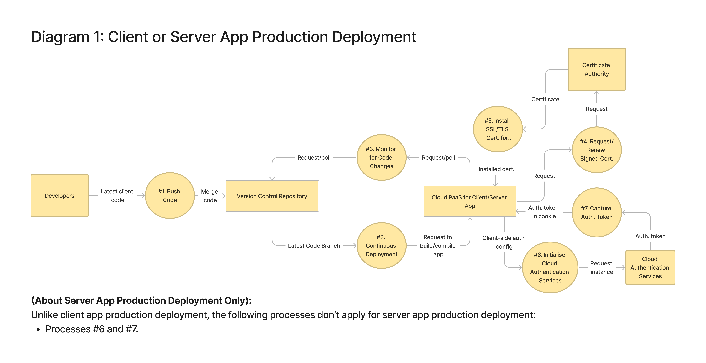
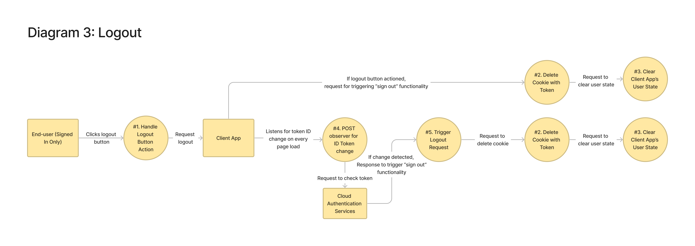
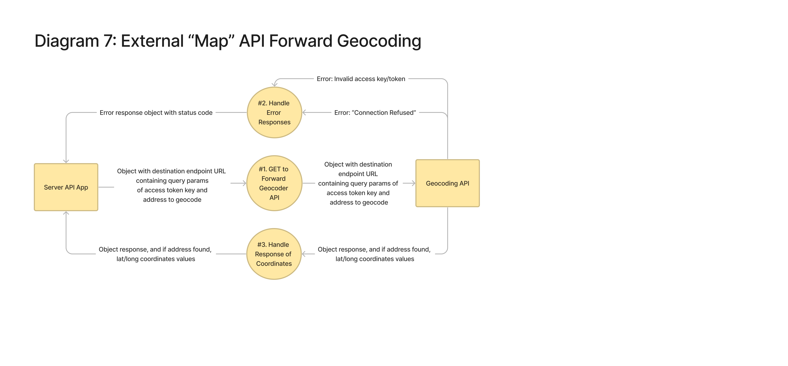
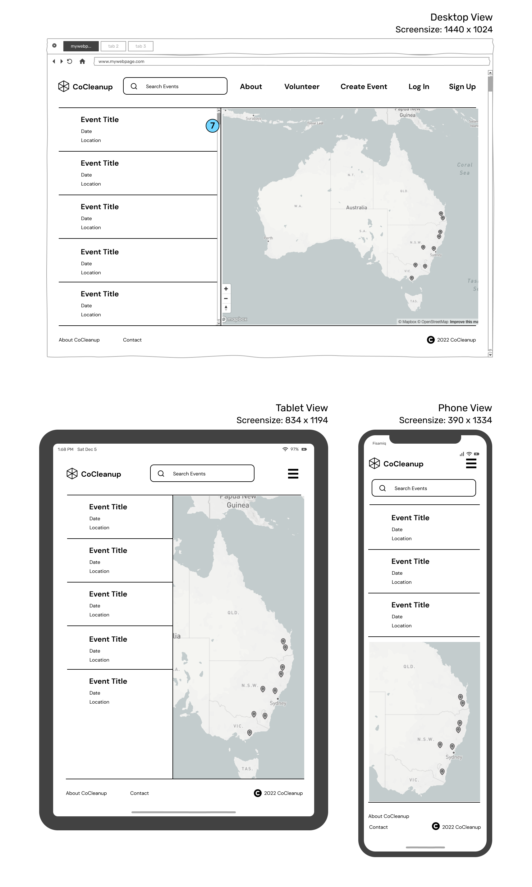
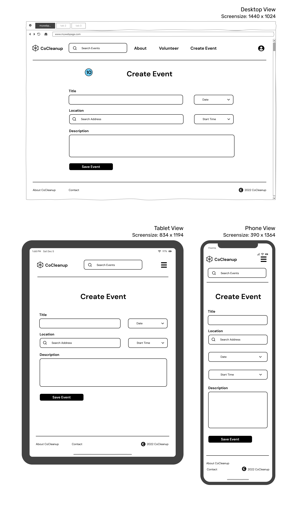
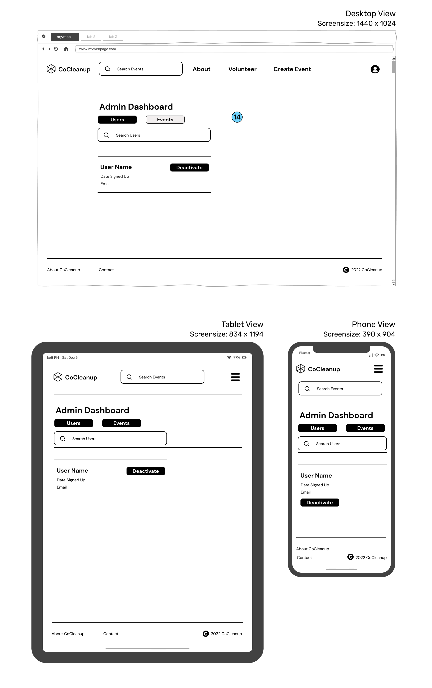

# Co Cleanup: MERN full-stack app <!-- omit in toc -->
### Chris Hullman & Mick Caffery <!-- omit in toc -->
### T3A2 (Part A) Assignment <!-- omit in toc -->

## Table of Contents <!-- omit in toc -->
- [Links](#links)
    - [GitHub Part A Link:](#github-part-a-link)
- [Overview](#overview)
  - [Purpose](#purpose)
  - [Functionality & Features](#functionality--features)
  - [Target Audience](#target-audience)
  - [Tech Stack](#tech-stack)
- [Dataflow Diagrams](#dataflow-diagrams)
    - [Note about the below diagrams](#note-about-the-below-diagrams)
    - [Dataflow Diagrams Legend](#dataflow-diagrams-legend)
    - [Diagram 1 - Client or Server App Production Deployment](#diagram-1---client-or-server-app-production-deployment)
    - [Diagram 2 - Sign-Up then Automatic Sign-In](#diagram-2---sign-up-then-automatic-sign-in)
    - [Diagram 3 - Logout](#diagram-3---logout)
    - [Diagram 4 - Co Cleanup 'Events' API Resource](#diagram-4---co-cleanup-events-api-resource)
    - [Diagram 5 - Co Cleanup 'Comments' API Resource](#diagram-5---co-cleanup-comments-api-resource)
    - [Diagram 6 (Part 1) - Administrator User Role - Find Any User](#diagram-6-part-1---administrator-user-role---find-any-user)
    - [Diagram 6 (Part 2) - Administrator User Role - Disable/Reenable Found User](#diagram-6-part-2---administrator-user-role---disablereenable-found-user)
    - [Diagram 7 - External 'Map' API Forward Geocoding](#diagram-7---external-map-api-forward-geocoding)
    - [Diagram 8 - External 'Map' API Rendering on Client App](#diagram-8---external-map-api-rendering-on-client-app)
- [Application Architecture Diagram](#application-architecture-diagram)
- [User Stories](#user-stories)
  - [User Stories - Board Link:](#user-stories---board-link)
  - [User Stories - About:](#user-stories---about)
  - [Revision 1:](#revision-1)
  - [Revision 2:](#revision-2)
  - [Revision 3:](#revision-3)
- [Wireframes](#wireframes)
  - [Landing Page](#landing-page)
  - [Sign Up Page](#sign-up-page)
  - [Sign-In Page](#sign-in-page)
  - [Events Search Page](#events-search-page)
  - [Event Page](#event-page)
  - [Create & Update Event Page](#create--update-event-page)
  - [User Dashboard](#user-dashboard)
  - [Admin Dashboard](#admin-dashboard)
- [Project Management](#project-management)
  - [Overview](#overview-1)
  - [Timeframe](#timeframe)
  - [Kanban Board](#kanban-board)
  - [Scrum Sprints & Ceremonies](#scrum-sprints--ceremonies)
    - [*Planning Meetings*](#planning-meetings)
    - [*Daily Standups*](#daily-standups)
    - [*Sprint Reviews*](#sprint-reviews)
  - [Pair Programming](#pair-programming)
  - [Source Control](#source-control)
- [Sprint 1](#sprint-1)
  - [Planning meeting 1](#planning-meeting-1)
  - [Planning meeting 2](#planning-meeting-2)
  - [Sprint Review](#sprint-review)
- [Sprint 2](#sprint-2)
  - [Planning meeting](#planning-meeting)
  - [Sprint Review](#sprint-review-1)

## Links

#### GitHub Part A Link:

[**https://github.com/Community-Cleanup/community-cleanup-docs-partA**](https://github.com/Community-Cleanup/community-cleanup-docs-partA)

## Overview

### Purpose

After a natural disaster strikes, communities are often left with the enormous clean-up effort required to restore people's homes, businesses and community areas. During these times government, council and emergency services resources are often stretched thin. Co Cleanup, short for Community Clean-up, aims to help communities better coordinate the clean-up process after a natural disaster, or any time that community members would like to coordinate group action for the betterment of their community. Clean-up tasks may involve the removal of debris, non-hazardous waste, and/or minor repairs, removal or replacements of small objects such as plants, furniture or garbage.

It should be noted that this platform is not to replace the coordination of emergency services in critical disaster recovery contexts or when the personal safety of any individual is at risk due to any given disaster situation.

**Co Cleanup has been designed and built by Chris Hullman and Mick Caffery as their final cap-stone project for Coder Academy’s Full Stack Development Bootcamp, 2022.**

### Functionality & Features

The functionality & features are described below for unregistered visitors, registered users and administrators. 

**Visitors**

- Can view the landing page to understand Co Cleanups' purpose and why it might be useful
- Can search and view all clean-up events (locations displayed on a map)
- Can view all details about clean-up events
- Are able to sign up to become a registered user
- Vital safety information displayed as paramount to all users attending a clean-up event, with reminders to leave critical emergency recovery situations to trained safety and recovery professionals (e.g. SES)

**Registered Users**

- Secure sign-up & sign-in with a robust cloud authentication platform (Firebase)
- Can create clean-up events
- Functionality to upload and display photos to an event the user has created.
- Can register to participate in a clean-up event
- Can add comments to a clean-up event that you are registered for or have created

**Administrators**

- Assure the safety of registered users with the functionality of role-based access control (RBAC).
- Can search for and view all users
- Can deactivate or remove any users and events if any inappropriate content is shown.

### Target Audience

Co Cleanup is aimed at community members, organisations, emergency services or councils to help inform and coordinate clean-up efforts post-natural disaster. Willing volunteers can use this app to know the time and locations of coordinated clean-ups and where help is most needed.

### Tech Stack

**Front-end:** HTML5, CSS3, JavaScript, React.js, Axios

**Back-end:** Node, ExpressJS, Mongoose, MongoDB, Firebase Authentication, Firebase Cloud Storage

**Authentication:** Firebase Authentication

**Deployment (Server):** Heroku 

**Deployment (Database):** MongoDB Cloud Services

**Deployment (Front-End):** Netlify

**APIs** Mapbox maps & geocoding

**Testing:**  Jest

**Source Control:** Git & Github

**Project Management:** Trello & TeamGantt

**UI Design:** Figma

## Dataflow Diagrams

#### Note about the below diagrams

Besides the 'Legend' diagram below, all subsequent Dataflow Diagrams have their processes (circle shapes) numbered.

The numbered lists below each Dataflow Diagram indicate the sequence, in ascending order, of data flow for each process. Note however that many processes are performed asynchronously, or sometimes not at all for any given live process transaction - e.g. in the case of error responses.

#### Dataflow Diagrams Legend

#### Diagram 1 - Client or Server App Production Deployment

1. One or more developers on a local development machine will push (or pull request) the latest code base to the central main/master branch of a version control/source code repository.
2. With repository and client or server app cloud 'Platform as a Service' (PaaS) authorised to link together, the initial version of the code base will automatically be sent to the PaaS system.
3. Polls will be sent to and/or from the repository and the PaaS system to monitor for codebase changes, and if a new change is detected, automatically re-push the new code onto the PaaS system (i.e. Continuous Deployment).
4. The client or server app PaaS system will request from a Certificate Authority (CA) for a new or renewed TSL/SSL certificate.
5. The signed certificate will be sent back to the client or server app PaaS system to enable HTTPS on the deployed client or server app.
6. For the client app, the public access keys to the cloud authentication services systems will be sent.
7. The cloud authentication services systems will return an authentication ID token to store in a cookie on the client app PaaS system.

#### Diagram 2 - Sign-Up then Automatic Sign-In

1. From a sign-up form on the client app, the user's username, email and password as user input will be added to the client app.
2. With the client-app-side validated username, email and password it will be sent as a POST request to the cloud authentication services. Included in the request will be a flag to bypass any email verification requirements for the sign-up.
3. With the cloud authentication services attempt at validating the email and password on its systems, if this is a *sign up*, attempt to save the user's email and secured password on its systems, alternatively for *sign in* attempt to retrieve the existing user from its systems. The auth services will respond back with an object to the client, depending on whether it was successful or not.
4. From process #3, one of three error responses may occur: "Weak Password", "Invalid Email", or "Operation Not Allowed". Or only "User Not Found" error if this is a *sign in* request only.
5. Alternatively, if successful user creation on the auth system services, return a response object with the ID token (JWT) with token metadata such as expiry time.
6. Clear any existing cookies stored on the end user's web browser.
7. Store a copy of the ID token on a cookie on the end-user's web browser.
8. Send a POST request to the server API app with the ID token for validation against the "admin" side of the cloud authentication services.
9. From process #8, an error response of "Connection Refused" may occur if there's a network error, for example.
10. Send a POST request with the ID token to the admin cloud authentication services to validate it.
11. If the ID token is deemed still valid, decode the user's claims from the payload to retrieve the user's details (email, username, etc.) in plain text.
12. With the decoded claims, as an object, and as a query filter, send a database query to the NoSQL database to create a new user (for *sign up*) on the database, or fetch the user (for *sign in*) from the database.
13. Respond with any connection/network errors to the database that may have occurred.
14. If the database query was successful retrieve the user's details from the database as a document as per NoSQL database design, which the server API app will handle and store as an object.
15. A promise from the client app for the user's details from the database should be resolved and the user's decoded details stored in *state* on the client app.

*Note that for any future requests to protected endpoints that require sign-in or other authorisation (e.g. user administrator role requirements), the token stored in the cookie from process #7 will be used to send back to the server API to repeat the above same token decoding and database query processes.*

#### Diagram 3 - Logout

If the signed-in end-user clicks the logout button, the following three processes will occur:
1. The signed-in end-user fires/clicks the logout button on a webpage which will trigger a handler on the client app to request a logout.
2. Functions will be executed to delete the cookie on the end-user's web browser.
3. Functions will be executed to clear out the user *state* on the client app.

Alternatively, if a listener/observer on the client app detects from the cloud authentication services that the user's token has been changed or is no longer valid on the cloud auth services, process #5 will occur to trigger the same processes as processes #2 and #3, above.

#### Diagram 4 - Co Cleanup 'Events' API Resource

1. The end-user triggers an action on their webpage to see all created events.
2. Or, the end-user triggers an event on their webpage to see only their own created events.
3. Or, the end-user triggers an event on their webpage to see a particular event by requesting the unique ID (UID) of the event.
The client app will then either send one of the following relevant CRUD requests (from #4 to #9) to the server API app:
4. Send a GET request for all existing events.
5. Send a GET request for the user's own created events.
6. Send a GET request to get a particular event by its UID.
7. Send a POST request to create a new event with the event details (title, address, description, etc.) as an object - only if the user is signed in.
8. Send a PUT request to edit an event with the updated details as an object - only if the user is signed in, and it's their own event or the user is an administrator.
9. Send a DELETE request to delete an event - only if the user is signed in, and it's their own event or the user is an administrator.
10. The server API app may respond with one of the following two errors: "Connection Refused", or later on, a database query error back to the client app as an object.
11. Query the database depending on the above CRUD operation chosen.
12. If the CRUD event requires authorisation permission and the server API app has approved this, e.g. the user is signed in, and whether or not the user is an administrator, conduct one of the following three CRUD processes against the database:
13. Query the database to create a new event.
14. Query the database to edit an event.
15. Query the database to delete an event.
16. If there is a database error, the server API app will retrieve a response that the database connection/network has failed as an object.
17. If the query operation was successful, respond with an object with details of the selected, or updated event. If the event was deleted, respond with the correct status code.
18. If the POST, PUT or DELETE CRUD operation was unauthorised, respond with a status code 401 error object.
19. The server API will respond to the client app with a validated model instance of the event(s) object including the status code/message.

#### Diagram 5 - Co Cleanup 'Comments' API Resource

1. The end-user triggers an action on their webpage to see all comments by an event UID.
The client app will then either send one of the following relevant CRUD requests (from #2 to #4) to the server API app:
2. Send a GET request for all existing comments on an event.
3. Send a POST request for a new comment on an event with an object containing the comment description -  only if the user is signed in and they are attending the event.
4. Send a DELETE request to delete a comment - only if the user is signed in, and it's their own comment or the user is an administrator.
5. The server API app may respond with one of the following two errors: "Connection Refused", or later on, a database query error back to the client app as an object.
6. Query the database for comment(s) depending on the above CRUD operation chosen.
7. If the CRUD event requires authorisation permission and the server API app has approved this, e.g. the user is signed in, and whether or not the user is an administrator, conduct one of the following two CRUD processes against the database:
8. Query the database to create a new comment for an event.
9. Query the database to delete a comment on an event.
10. If there is a database error, the server API app will retrieve a response that the database connection/network has failed as an object.
11. If the query operation was successful, respond with an object with details of the selected comment. If the event was deleted, respond with the correct status code.
12. If the POST or DELETE CRUD operation was unauthorised, respond with a status code 401 error object.
13. The server API will respond to the client app with a validated model instance of the comment(s) object including the status code/message.

#### Diagram 6 (Part 1) - Administrator User Role - Find Any User

1. The administrator end-user searches for any user by their username on their administrator-only webpage on the client app.
2. A GET request with the requested user's username as a query string/param is sent to the server API app.
3. The server API app may respond with one of the following two errors: "Connection Refused", or later on, a database query error back to the client app as an object.
4. Query the database with the requested user's username and find their database entry by their UID.
5. If there is a database error, the server API app will retrieve a response that the database connection/network has failed as an object.
6. If the query operation was successful, respond with an object with details of the selected user.
7. The promise on the client app should resolve successfully with the user's details from the server API app.

#### Diagram 6 (Part 2) - Administrator User Role - Disable/Reenable Found User

1. The administrator end-user, with their found user, triggers a form action or button to enable or disable a user's account.
2. A PUT request with the found user's details with the enable/disable boolean is sent to the server API.
3. The server API app may respond with one of the following two errors: "Connection Refused", or later on, a database query error back to the client app as an object.
4. Query the database with the requested user's UID and find their database entry by their UID and update their database document with the enabled/disabled boolean.
5. If there is a database error, the server API app will retrieve a response that the database connection/network has failed as an object.
6. If the query operation was successful, respond with an object with details of the selected and now updated user.
7. The promise on the client app should resolve successfully with the now updated user's details from the server API app.

#### Diagram 7 - External 'Map' API Forward Geocoding

1. The server API app sends a GET request of an object including the URL of the Geocoding API endpoint, and the query string/params of the access token for the API and the address of the location to forward geocode.
2. The server API app may respond with one of the following two errors: "Connection Refused", or an invalid access key/token error, as an object to the server API app.
3. If successful, the server API app will receive a resolved promise that the Geocoding API will respond with an object containing the latitude and longitude coordinates of the address if found.

#### Diagram 8 - External 'Map' API Rendering on Client App

1. The client app sends a GET request of an object including the URL of the Maps API endpoint, and the query string/params of the access token for the API.
2. The client app may respond with one of the following two errors: "Connection Refused", or an invalid access key/token error, as an object to the client API app.
3. If successful, the client API app will receive a resolved promise that the Maps API will respond with the object with the map details that the pre-installed client-side SDK of the maps service can utilise to render the map graphics on the client app display.

## Application Architecture Diagram

**Legend**

1. The client (front end) represents the technologies that users interact with directly. The main components are React (components), Axios (XHR), and deployed on Netlify
2. React is an open-source front-end JavaScript library for building user interfaces with UI components. The diagram shows the main front-end React components that make up the application. Each of these components uses Axios to make XHR requests and the event pages use the Mapbox API for geocoding.  
3. Axios is a promise-based XMLHttpRequests (XHR) client that is used to make requests to the backend. These requests send and receive JSON data. An example is sending data from the “Create Event” form to a backend REST API endpoint. The React front-end components also receive JSON data via Axios to update state and access the data. 
4. The front end is built, deployed and hosted by Netlify, which also allows for automated deployments direct from Github. 
5. The server (back end) represents all of the technologies that process incoming requests from the client and generate the response. The server uses Node.js as an environment runtime, ExpressJS to create the REST API, Mongoose for database modelling, Firebase for user authentication and MongoDB as a cloud-hosted NoSQL database. 
6. Node.js is the environment runtime that executes JavaScript code outside of a web browser. 
7. ExpressJS is a backend framework that is used to build RESTful APIs. ExpressJS has been used to create all the backend API endpoints for CRUD operations for different database collections. 
8. Mongoose is used to create database models using schemas. These schemas represent how data will be stored in each database collection. Mongoose is responsible for creating and reading documents from the MongoDB database. 
9. The Node.js backend is built, deployed and hosted by Heroku. Heroku also allows for automated deployments direct from Github. 
10. Firebase Authentication provides a front and back-end authentication service, via node.js software development kits (SDK). These kits handle the authentication for the application. Firebase stores user details on a Firebase database. 
11. MongoDB is a NoSQL cloud-hosted database. With the use of Mongoose, data is modelled and stored within collections. 
12. The Mapbox Maps API is used to display Mapbox-created maps that can be used as a base layer for location data to be overlaid. The Mapbox Geocoding API converts location text into geographic coordinates. Geocoding is used when a user creates an event, then the location can be plotted on the base layer map. 

## User Stories

### User Stories - Board Link: 

[**https://trello.com/b/kBMQdaEN/user-stories-co-cleanup**](https://trello.com/b/kBMQdaEN/user-stories-co-cleanup)

### User Stories - About: 

The Co Cleanup app User Stories Trello board has an **INFORMATION** list (first board column) with cards that explain the approach, formatting and syntax to reading and editing the board and its User Stories. Below are direct links to the information cards (for each card, please read the card title, and the card description, if there is one):

- Structure of a User Story text - [https://trello.com/c/ikJvrfnR](https://trello.com/c/ikJvrfnR)
- Who are the personas? - [https://trello.com/c/uO42CR5e](https://trello.com/c/uO42CR5e)
- About RED labelled cards - [https://trello.com/c/FrhWO1ks](https://trello.com/c/FrhWO1ks)
- About ORANGE labelled cards - [https://trello.com/c/DpYXKgNt](https://trello.com/c/DpYXKgNt)
- How to delete/discard cards - [https://trello.com/c/3QqTMrCv](https://trello.com/c/3QqTMrCv)
- How to edit cards - [https://trello.com/c/zDDxwutQ](https://trello.com/c/zDDxwutQ)

### Revision 1:

This is the original draft User Stories version from Week 1 of the sprint, with the planned articulated User Stories categorised into persona needs and "must haves" vs "would like to have" features of the app.

### Revision 2:

In this revision from Week 2 of the sprint, the following changes were made:
- It was discussed and clarified that our target audience would like to see, as read only, all existing cleaning events that are scheduled without needing to be signed in to the app.
- For clarity, when the user first signs up into the app, they can specify a nickname as their username, hence we discarded the user story card relating to concerns of privacy of the user's full, real name.

### Revision 3:

In this revision from Week 2 of the sprint, the following changes were made:
- The functionality for a user to upload and attach one or more photos to an event when creating their own event will be an optional (i.e. "would like to") requirement outside of the scope of the MVP and will be implemented if the timeframe allows.

## Wireframes

### Landing Page

The landing page will be the page that visitors see when they navigate to the root URL. It is designed so that users can quickly learn what the app is for and why it might be useful for them. Details about this page include:

1. The search bar can be used by visitors who are not logged in to view events. When the search bar is focused, the landing page will navigate to the events search page. The about and volunteer links will navigate to information about how the site work and how users can volunteer at events. The create event link will navigate to the create event form, but only if the user is signed in. If the user is not signed in, then this form will navigate to the sign-up page.
2. The log-in and sign-up links will not be displayed if a user is signed in, instead a user account icon link will be displayed.
3. The landing page component will consist of a Co Cleanup title, blurb about Co Cleanup, hero image and links to sign up and view events. 
4. The footer will have links to the about and contact pages, along with copyright text. 

### Sign Up Page

The sign-up page is a minimal design that makes it clear to the user what is needed to sign up.

5. By signing up the users agree to the Terms of Service, Privacy Policy, and Cookie Policy. Coloring and underlining will show the user that these headings are also clickable links so that they can read the associated terms and policies.

### Sign-In Page

The sign-in page is another minimal design and will use similar components for the sign-up page.

6. There will be a link to the sign-up page, in case the user has not created an account previously. 

### Events Search Page

7. The events search page is designed so that users can easily see which clean-up events have been organised and where they are located. As users search for either event names or locations, the list of events will be filtered, and associated markers displayed on the map.

### Event Page

The event page is designed to clearly show all details about the upcoming event.

8. A register button so that signed-in users can register for an event. If the users are not registered, then this button will navigate them to the sign-in page. 
9. Is a feature for users to be able to leave comments about the event, so that event organisers can reply with further information. 

### Create & Update Event Page

The create event page is designed so that users can easily create and update events. 

10. Signed-in users can navigate to this page from the create event button in the navbar. If they would like to update an event they can navigate to the update event page by a link in their user dashboard under the heading “My Events”, which lists the events they have organised. 

### User Dashboard

The user dashboard is designed so that users can easily see all details relating to them.

11. The details section will show their username and email which can be updated.
12. The “Attending” section will show all events that they have registered for. These events can be clicked and the user is navigated to the event page.
13. The “My Events” section will show a list of all the events that the user has created. They can choose to update or delete the event. 

### Admin Dashboard

The admin dashboard is designed so that administrators of Co Cleanup can manage users and events.

14. Admin can select if they will search for users or events. Once they have found the user or event, they can deactivate the user or event. 

## Project Management

### Overview

In the beginning, we discussed how we should effectively manage the project and the tools we should use. We aimed to incorporate different tools and methods from Agile Project Management frameworks like Scrum and Kanban that would suit our team size, project scope and timeframe. 

### Timeframe

We were given a timeframe of five weeks to complete both Part A and Part B of the assignment, starting on Wednesday 19th of October 2022 until the final due date of Wednesday 23rd of November 2022. The contact hours throughout the Bootcamp were Monday to Wednesday, 9 am to 5 pm. We chose to keep this as the core contact hours for the project. Due to team members' work commitments and job search efforts, we decided that any additional hours from Thursday to Sunday would be planned ahead.

### Kanban Board

We decided to use Trello to manage our Kanban board as we both had experience with this product. We used the Kanban board to create a backlog of tasks or user stories that would be required to move the project forward. Then move each item into an “in progress” section while being worked on, then finally move the item to the “done” section once complete. As a team, we both took responsibility for organising the backlog and communicating to each which items were being updated. 

### Scrum Sprints & Ceremonies

We decided to break the 5-week period into five sprints based on the Scrum framework. We would use these sprints to plan and build our product in a series of five iterations, which would help break down the final product into manageable pieces of work. We predict that this approach will help us ship our work sooner and more frequently, whilst giving us the opportunity to adapt and change as we receive feedback from user testing. 

#### *Planning Meetings*

We decided that each sprint would start each Monday and begin with the planning ceremony (meeting). During each planning meeting we discussed what we would like to achieve during the sprint and the value that goal would bring to the project. We then moved items from the product backlog that were necessary to complete the sprint, and delegated how we would complete these items. Finally each of the items moved from the backlog was broken down into an increment that would be achievable to be completed in one day.

Based on this approach, each planning meeting addressed the following three questions:

**What is the main sprint goal and the value that would bring to the project?**

**Which items can be moved from the backlog to achieve this goal?**

**How should we break down the chosen items into daily increments?**

To help with tracking the tasks in each week's sprint we used a Gantt chart. The Gantt chart we used was a Trello power-up created by TeamGantt, making it easy to move tasks in the backlog into each sprint. 

#### *Daily Standups*

The purpose of our team's morning standup (during core days) was to discuss the progress towards the sprint goal and adapt the backlog as necessary. As we were a small team of just two, on top of our morning stand-up we were in frequent communication throughout the day discussing any challenges or re-evaluating the daily plan. 

#### *Sprint Reviews*

The purpose of our sprint reviews is to review what was accomplished during the Sprint, adjust the product backlog, and determine future adaptations to the project. 

### Pair Programming

We wanted to incorporate pair programming into our workflow as a way to share knowledge, write better code and problem solve together. We chose to use pair programming as a way to get started on our server and client code bases, and when each of us encountered any difficult work items. The main tool we used to pair program was VS Code Live Share. We discovered this was a great tool where we could collaborate and write code in unison live on the one project. While pair programming in VS Code Live Share we used Discord to provide video, voice and chat. 

### Source Control

We decided that the 'Git Feature Branch Workflow' would be the best for our small team size. Both of us would work on separate feature branches and push our branches to the central repository, then merge our changes into the main codebase using a pull request. This meant that the main codebase would never contain broken code and allow for continuous integration of the deployed back-end and front-end.

## Sprint 1

### Planning meeting 1

We kicked off the project with an initial planning meeting. This is where we discussed potential ideas and submitted our chosen idea for approval. We then discussed how we would like to manage the project and which tools and methods would suit. We then talked about the initial tasks that we both would work on. 

The Kanban board below was created after this initial planning meeting and reflects these initial tasks and backlog. We decided that we should place an emphasis on revising the MERN masterclass presented by our class instructors on the previous two days, as the concepts covered were crucial to our team performing well on this assignment.

Due to the first day of the project starting on Wednesday, and the core contact hours for the project being Monday to Wednesday we decided that we would hold another planning meeting on the following Monday. 

### Planning meeting 2

**The topics discussed were:**

**What is the main sprint goal and the value it would bring to the project?**

- The main sprint goal this week was to have a basic Express server deployed to Heroku with CRUD functionality for ‘users’ and ‘events’, with data being stored on MongoDB cloud. On top of this, we would create a React Front end deployed to Netlify with a simple form to create an event. 
- A secondary goal was to have all of our initial users' stories documented
- These goals would bring value to our project by following the principles of CI/CD and the mantra “deploy often and deploy early”. Due to the flexibility of Express and the MongoDB data structure we aimed to build a working “core server” that was deployed that we could build upon as we worked through each user story.

**Which items can be moved from the backlog to achieve this goal?**

- Items moved from the backlog included:
  - Setting up Express Back-end and deploy
  - Document user stories
  - Scaffold React front-end and deploy
  - Build basic forms for Register & Sign In
  - Build a basic form for Registering for an Event

**How should we break down the chosen items into daily increments?**

  - Monday would be spent developing User stories and documentation
  - Tuesday would be spent Setting up Express Back-end and deploy
  - Wednesday would be spent setting up React front-end, deployment and basic forms

### Sprint Review

The screenshots below show the implementation board at the end of sprint 1. We achieved the majority of what we planned for the sprint, however, did not start any development of the front end. The Gantt chart shows which items were worked on each day of the sprint. 

As this was the first sprint for the assignment we learnt a lot about time management and what is achievable in a single sprint. We also came up against parts of the development process that were more difficult than expected. 

During this sprint, a difficult task was understanding how to set up Firebase Authentication on the frontend. We decided that we should adjust our backlog and devote time to researching and understanding how best to implement Firebase authentication into our project. 

There were no major adaptations to the project. However, in review, we were able to adjust which tasks should be given priority in order to meet the assignment requirement of submitting the Part A documentation by the end of sprint two. 

## Sprint 2

### Planning meeting

**The topics discussed were:**

**What is the main sprint goal and the value that would bring to the project?**

- The main sprint goal this week was to research and understand Firebase Authentication. Our next main goal was to finish all the required wireframes, diagrams, and Readme documentation required for the Part A submission. 
- The value these goals would bring to the project would be that through a better understanding of authentication, we would be able to design and draw more accurate data flow diagrams, which is a requirement for Part A. The goal of finalising the Readme documentation ahead of time, will also allow us to review and make any changes before the Part A due date, and also enable us to continue working on Part B of the assignment. 

**Which items can be moved from the backlog to achieve this goal?**

- Items moved from the backlog included:
  - Research Firebase Authentication
  - Data Flow Diagram Increment 2
  - Architecture Diagram Increment 2
  - Finalise Wireframes
  - Finalise Part A Readme

**How should we break down the chosen items into daily increments?**

- Following on from our previous sprint, the dataflow diagram and architecture diagram have already been broken down into a daily increments, with the first increments being completed in sprint 1. The remainder of the tasks have been planned to take less than one day.

### Sprint Review

The screenshots below show the implementation board at the end of sprint 2. The Gantt chart shows which items were worked on each day of the sprint. We successfully completed all of the major items and completed the Part A Submission ahead of time. 

There were no major adaptations to the project. The end of sprint 2 marks the end of our planning phase for the project. 

